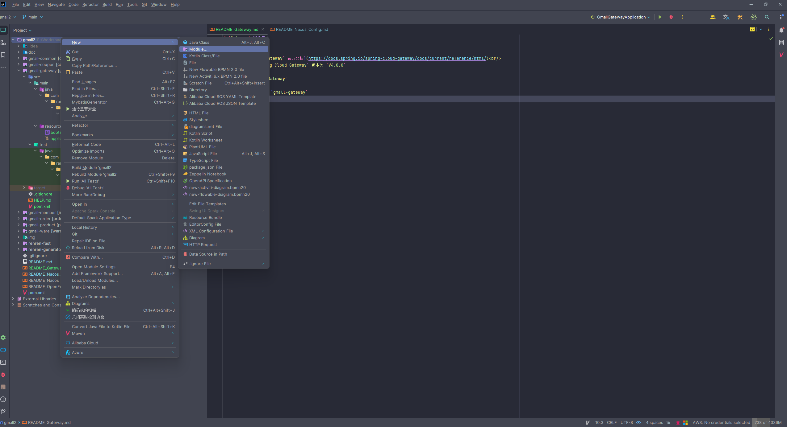
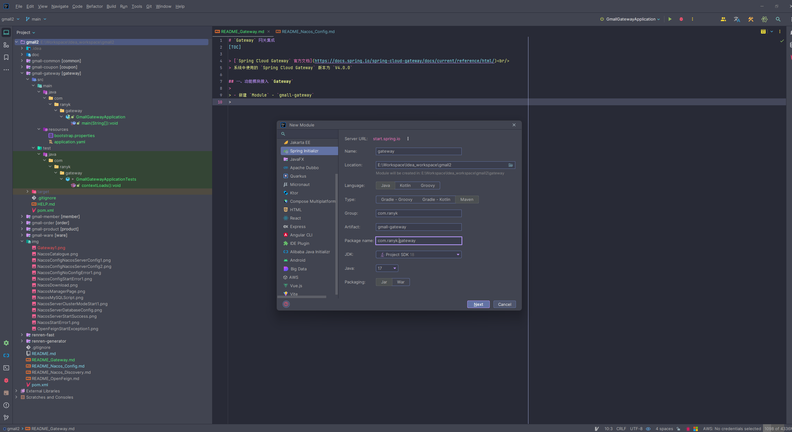
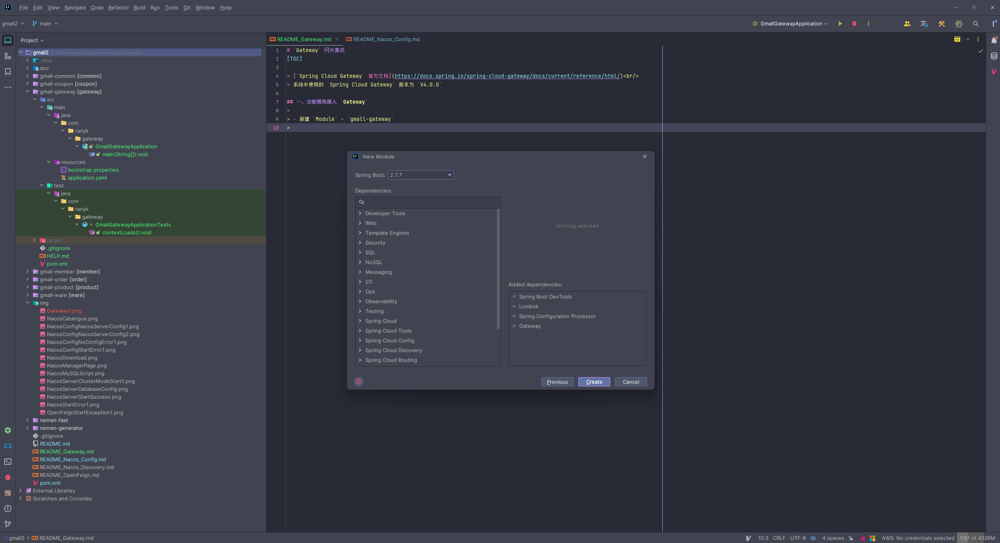
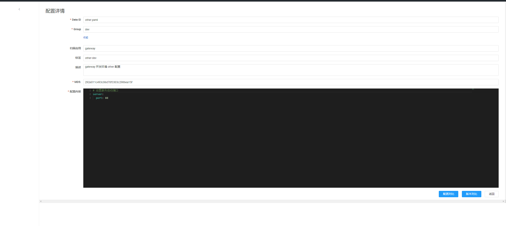
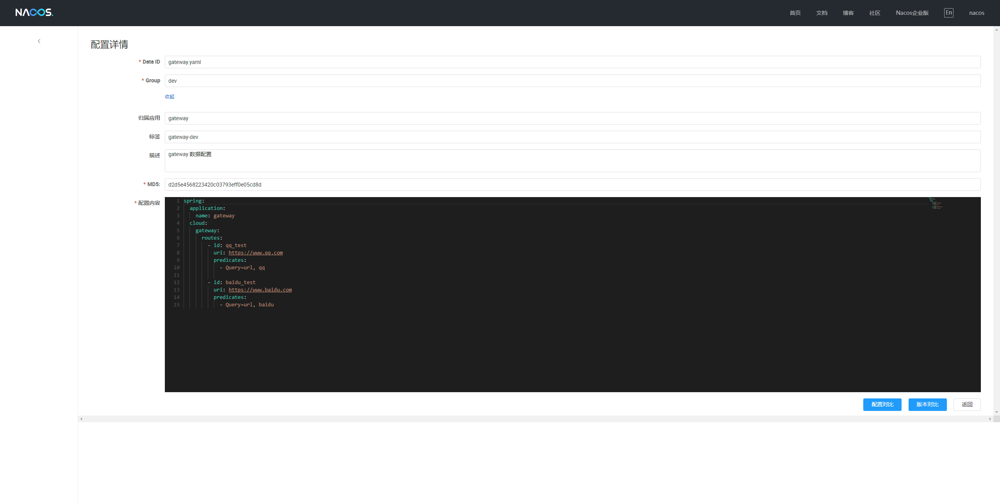

# `Gateway` 网关集成
[TOC]

> [`Spring Cloud Gateway` 官方文档](https://docs.spring.io/spring-cloud-gateway/docs/current/reference/html/)<br/>
> 系统中使用的 `Spring Cloud Gateway` 版本为 `V4.0.0` 

## 一、功能模块接入 `Gateway` 
>
> - 新建 `Module` - `gmall-gateway`
> 
> 
> - 引入对应的依赖
> 
> - 修改 `pom.xml` 
> >- `Spring Boot 版本调整如下`
> ```xml
>     <parent>
>        <groupId>org.springframework.boot</groupId>
>        <artifactId>spring-boot-starter-parent</artifactId>
>        <version>2.7.1</version>
>        <relativePath/> <!-- lookup parent from repository -->
>    </parent>
> ``` 
> >- 引入 `common` 包依赖
> ```xml
>       <dependencies>
>               <dependency>
>                   <groupId>com.ranyk</groupId>
>                   <artifactId>common</artifactId>
>                   <version>0.0.1-SNAPSHOT</version>
>                   <exclusions>
>                       <!-- 排除 common 包中 spring-web 依赖,网关项目不需要该依赖 -->
>                       <exclusion>
>                           <groupId>org.springframework.boot</groupId>
>                           <artifactId>spring-boot-starter-web</artifactId>
>                       </exclusion>
>                   </exclusions>
>               </dependency>
>       </dependencies>
> ```
> > - 设置 `Spring Cloud` 版本号为 `<spring-cloud.version>2021.0.5</spring-cloud.version>` <br/>
> > - 在启动类上添加排除数据源自动配置依赖 (在 `GmallGatewayApplication` 类上修改 `@SpringBootApplication` 注解为 `@SpringBootApplication(exclude = {DataSourceAutoConfiguration.class})` ) <br/>
> > - 增加 `bootstrap.properties` 配置文件,配置类容如下: 
> ```properties
>       #配置应用名称,如果没有配置 spring.cloud.nacos.config.prefix 参数,则取当前参数值作为配置文件前缀,
>       #Nacos 配置中心的 dataId 组成规则为 ${prefix}-${spring.profiles.active}.${file-extension}
>       #如果系统没有配置 spring.profiles.active 属性则组成规则为 ${prefix}.${file-extension}
>       spring.application.name=gateway
>       # 配置 Nacos 配置服务器地址(此处配置生效)
>       spring.cloud.nacos.config.server-addr=127.0.0.1:8848
>       # 配置 Nacos 配置中心的配置内容的数据格式,目前仅支持 properties 和 yaml (此处配置 Nacos 配置文件数据格式生效)
>       spring.cloud.nacos.config.file-extension=yaml
>       # 配置 Nacos 配置中心的配置命名空间
>       spring.cloud.nacos.config.namespace=gateway
>       # 配置 Nacos 配置中心的配置组
>       spring.cloud.nacos.config.group=dev
>       spring.cloud.nacos.config.refresh-enabled=true
>       # 配置 Nacos 配置中心加载多配置集配置
>       spring.cloud.nacos.config.extension-configs[0].dataId=other.yaml
>       spring.cloud.nacos.config.extension-configs[0].group=dev
>       spring.cloud.nacos.config.extension-configs[0].refresh=true
>       
>       spring.cloud.nacos.config.extension-configs[1].dataId=devtools.yaml
>       spring.cloud.nacos.config.extension-configs[1].group=dev
>       spring.cloud.nacos.config.extension-configs[1].refresh=true
> ```
> > - 启动 `gmall-gateway` 项目, 访问如下地址 `http://localhost:88/?url=qq` 或 `http://localhost:88/?url=baidu` 将进入 腾讯网 或 百度网,即网关集成成功 <br/>
>
> **注意:** <br/>
> 1. 因为添加了 `Nacos` 配置中心的配置,所以需在 `Nacos` 配置中心中增加三个配置,配置如下: 
>    1. 增加 `Data Id` 为 `other.yaml` , `Group` 为 `dev` 的配置,配置内容如下:
>    
>    2. 增加 `Data Id` 为 `gateway.yaml` , `Group` 为 `dev` 的配置
>    
>    3. 增加 `Data Id` 为 `devtools.yaml` , `Group` 为 `dev` 的配置
>    