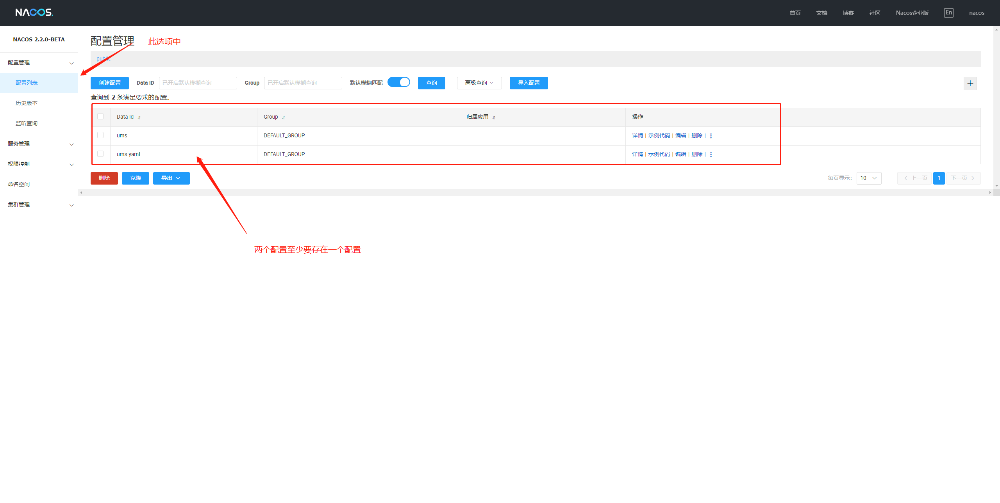
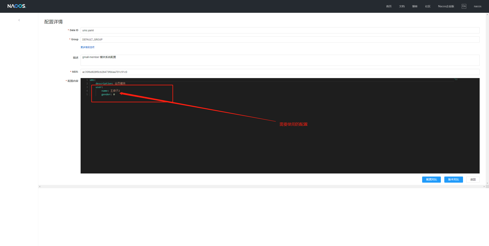
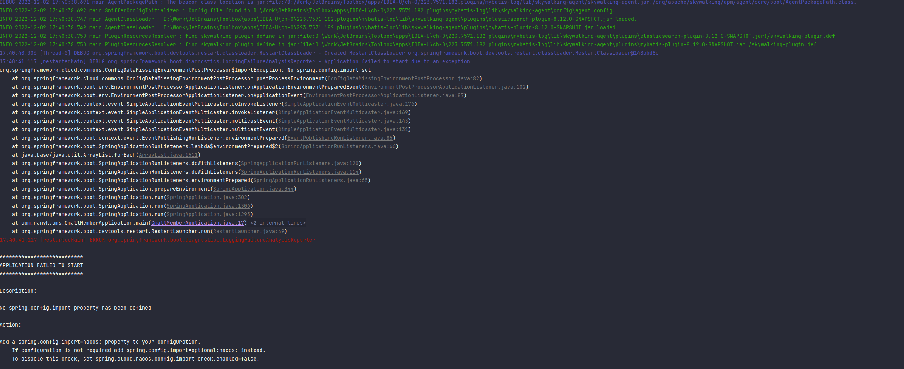
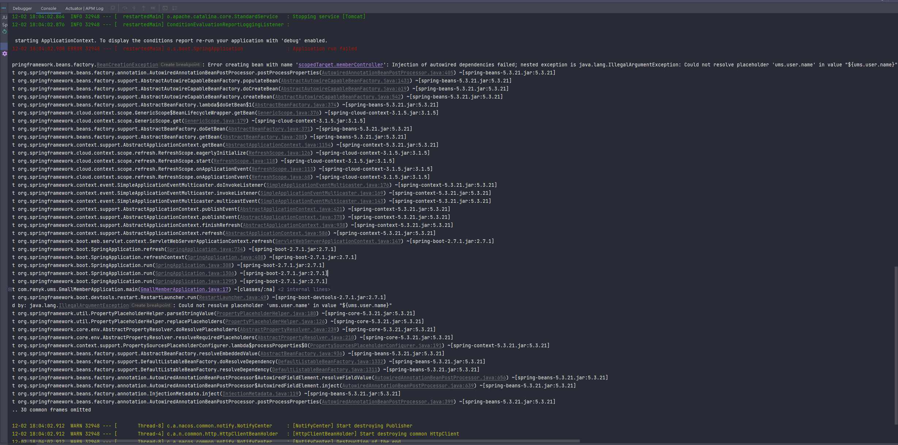

# `Nacos` 配置中心集成
[TOC]


> [官方说明文档连接](https://github.com/alibaba/spring-cloud-alibaba/blob/2021.x/spring-cloud-alibaba-examples/nacos-example/nacos-config-example/readme-zh.md)
> 本文使用的 `Nacos Server` 版本为 `2.2.0-BETA` , `Nacos Config` 版本为 `2021.0.4.0`

## 一、功能模块接入 `Nacos Config`
>
> - 在 `gmall-common` 模块(
    >    在该模块中引入的原因是,该模块为公共模块,所有的都会依赖此模块,则只需引入一次,而不会多次引入,避免多次引入相同的包) `pom.xml`
    >    依赖中添加 `Nacos Config Starter` 组件的依赖,同时由于配置了注册中心所以不需要引入 `spring-cloud-alibaba-dependencies` ,否则需要引入该依赖才能使用配置组件
>
> ```xml
> <dependency>
>     <groupId>com.alibaba.cloud</groupId>
>     <artifactId>spring-cloud-starter-alibaba-nacos-config</artifactId>
> </dependency>
> ```
> - 在应用的 `/src/main/resources/bootstrap.properties` 配置文件(没有的话需要创建)中配置 `Nacos Config` 元数据,添加如下配置:
> ```properties
> #配置应用名称,如果没有配置 spring.cloud.nacos.config.prefix 参数,则取当前参数值作为配置文件前缀,
> #Nacos 配置中心的 dataId 组成规则为 ${prefix}-${spring.profiles.active}.${file-extension}
> #如果系统没有配置 spring.profiles.active 属性则组成规则为 ${prefix}.${file-extension}
> #这里配置了建议还是在 application.yml 中配置一下 `spring.application.name` 应用名称两方应用名称需要一致,
> #否则以 application.yml 中配置为准
> spring.application.name=ums
> # 配置 Nacos 配置服务器地址(此处配置生效)
> spring.cloud.nacos.config.server-addr=127.0.0.1:8848
> # 配置 Nacos 配置中心的配置内容的数据格式,目前仅支持 properties(默认格式) 和 yaml (此处配置 Nacos 配置文件数据格式生效)
> spring.cloud.nacos.config.file-extension=yaml
> ```
> - 需要动态获取配置,则在使用的类上添加注解 `@RefreshScope` 即可,如在 `MemberController` 中使用配置的 `ums.user.name` 则使用如下代码
> ```java
>   package com.ranyk.ums.member.controller;
> 
>   import java.util.Arrays;
>   import java.util.Map;
>   import java.util.Objects;
>   
>   import com.ranyk.ums.member.feign.CouponFeign;
>   import org.springframework.beans.factory.annotation.Autowired;
>   import org.springframework.beans.factory.annotation.Value;
>   import org.springframework.cloud.context.config.annotation.RefreshScope;
>   import org.springframework.web.bind.annotation.PathVariable;
>   import org.springframework.web.bind.annotation.RequestBody;
>   import org.springframework.web.bind.annotation.RequestMapping;
>   import org.springframework.web.bind.annotation.RequestParam;
>   import org.springframework.web.bind.annotation.RestController;
>   
>   import com.ranyk.ums.member.entity.MemberEntity;
>   import com.ranyk.ums.member.service.MemberService;
>   import com.ranyk.common.utils.PageUtils;
>   import com.ranyk.common.utils.R;
> 
> 
> 
>   /**
>   * 会员
>   *
>   * @author ranYk
>   * @date 2022-07-29 17:27:34
>   */
>   // 使用自动刷新获取配置
>   @RefreshScope
>   @RestController
>   @RequestMapping("member/member")
>   public class MemberController {
>     /**
>       * 使用 Spring 的 @Value 注解获取配置值,注入到变量中
>       */
>     @Value("${ums.user.name}")
>     private String name;
>     @Value("${`ums.user.gender`}")
>     private Integer gender;
> 
> 
>     @RequestMapping("getUser")
>     public R getUser(){
>       MemberEntity member = new MemberEntity();
>       member.setUsername(name);
>       member.setGender(gender);
>       return R.ok().put("user",member);
>     }
> 
> }
> ```
> - 在 `Nacos Server` 上的配置中心添加配置,如在 `gmall-member` 模块中使用配置中心获取 `ums.user.name` 和 `ums.user.gender` 配置
>,则在 `Nacos Server` 中配置如下:
>  
>  
>   > 说明: 上图中存在 `ums` 和 `ums.yaml` 两个配置文件,是因为 `Nacos` 配置中心会加载这两个文件的配置,如果没有任意一个,或两者都不存时都会抛 `warning` 
> ,为避免警告故创建两个配置文件
> - 如果不先配置项目中使用到的值,则会抛 [异常](#error1)
> - 如果系统的配置文件和配置中心同时存在相同配置则会优先使用配置中心的值

## 二、接入异常

### 1）、启动报 `No spring.config.import property has been defined` 异常
> 
> - 异常原因
>   - `bootstrap.properties` 比 `application.properties` 的优先级要高,由于 `bootstrap.properties` 是系统级的资源配置文件,
>是用在程序引导执行时更加早期配置信息读取,而 `application.properties` 是用户级的资源配置文件,是用来后续的一些配置所需要的公共参数.
>而 `SpringCloud 2020.* ` 版本把 `bootstrap` 禁用了
> - 解决方案
>   - 导入 `bootstrap` 依赖即可
> ```xml
>   <!-- https://mvnrepository.com/artifact/org.springframework.cloud/spring-cloud-starter-bootstrap -->
>   <dependency>
>       <groupId>org.springframework.cloud</groupId>
>       <artifactId>spring-cloud-starter-bootstrap</artifactId>
>       <version>3.1.5</version>
>   </dependency>
> ```
### <a id='error1'>2）、启动报 `Could not resolve placeholder 'XXXX' in value "${XXXX}"` 异常</a>
> 
> - 异常原因
>   - 系统未配置对应的参数值
> - 解决方案
>   - 在系统的配置文件 `application.yml` 或 `application.properties` 等中添加配置
>,或者在配置中心中添加有关配置即可(配置文件和配置中心可同时配置,优先使用配置中心的值)
> - 参考链接
>   - [解决No spring.config.import property has been defined问题](https://blog.csdn.net/zhiyikeji/article/details/119855619)

## 三、`Nacos` 配置中心的相关配置管理

### 1）、
