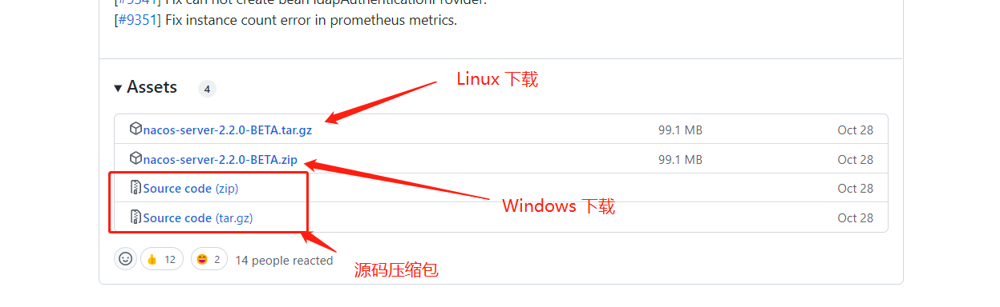
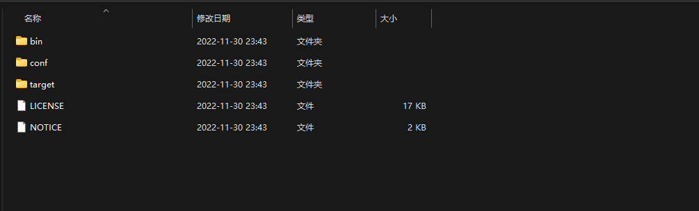
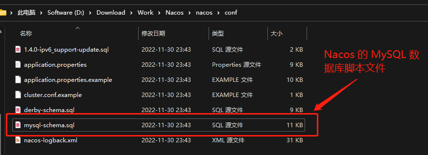
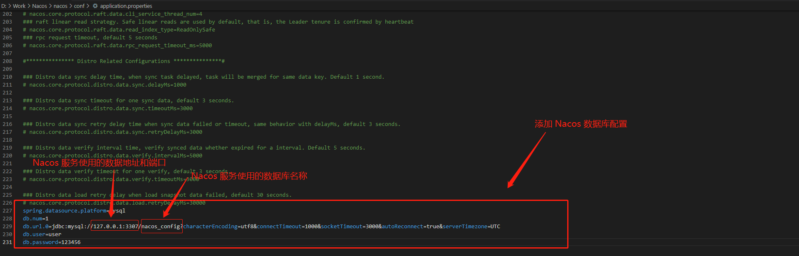
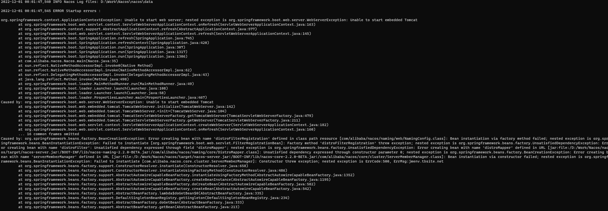
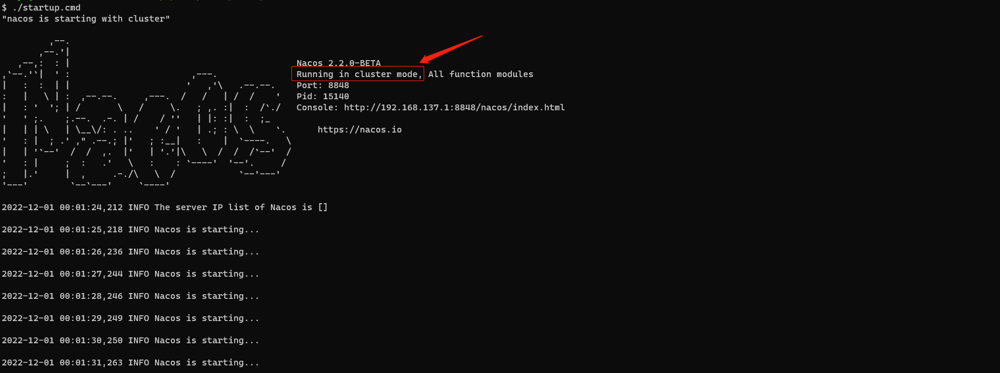
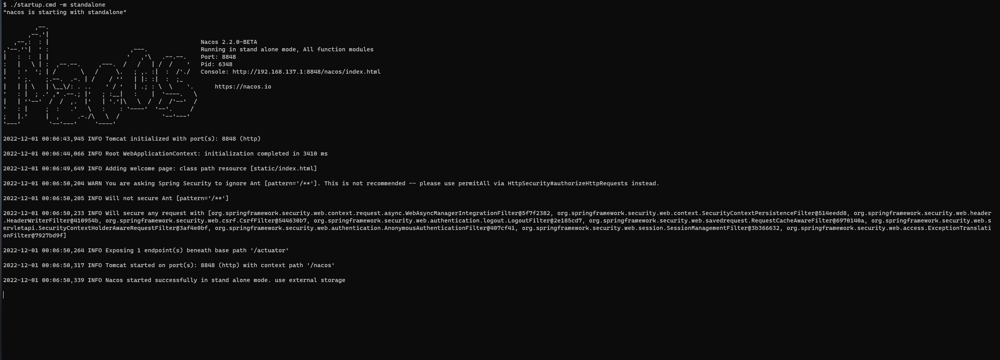
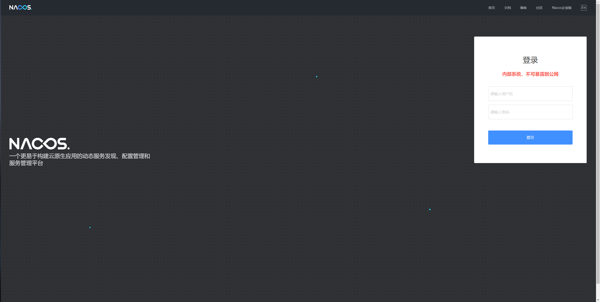

# `Nacos` 注册中心集成

[TOC]


> [官方说明文档连接](https://github.com/alibaba/spring-cloud-alibaba/blob/2021.x/spring-cloud-alibaba-examples/nacos-example/nacos-discovery-example/readme-zh.md)
> 本文使用的 `Nacos Server` 版本为 `2.2.0-BETA` , `Nacos Discovery` 版本为 `2021.0.4.0`

## 一、功能模块接入 `Nacos Discovery`
>
> - 在 `gmall-common` 模块(
>    在该模块中引入的原因是,该模块为公共模块,所有的都会依赖此模块,则只需引入一次,而不会多次引入,避免多次引入相同的包) `pom.xml`
>    依赖中添加 `Nacos Discovery Starter` 组件的依赖
>
> ```xml
> <dependency>
>    <groupId>com.alibaba.cloud</groupId>
>    <artifactId>spring-cloud-starter-alibaba-nacos-discovery</artifactId>
> </dependency>
> ```
> - 在对应功能模块的 `application.yml` 文件中配置 `Nacos Server` 地址,同时注册对应应用名称
>
>```yml
>spring:
>  application:
>    name: <!-- 此处填写对应应用名称,如 pms | ums 等 -->
>  cloud:
>    nacos:
>      discovery:
>        server-addr: <!-- 此处填写对应 Nacos 服务器地址和端口,如 127.0.0.1:8848 -->
>```
>
> - 在对应需要启用服务注册的启动类上添加注解 `@EnableDiscoveryClient` 开启服务注册与发现功能
> - 本项目中需要启动服务注册的模块有 `gmall-coupon` 、 `gmall-member` 、 `gmall-order` 、 `gmall-product` 、 `gmall-ware`

## 二、本地安装 `Nacos Server` 服务

### 1）、`Linux` 安装

> 暂无

### 2）、`Windows` 安装

> [参考链接 windows下启动nacos](https://blog.csdn.net/weixin_44021888/article/details/125993022)
> - 下载 `Nacos Server`
>   - [Nacos Server 下载页](https://github.com/alibaba/nacos/releases)
>  - 选择需要下载的 `Nacos Server` 版本,如下图 <br>
>    
>  - 解压下载的压缩包,得到如下图所示的结构 <br>
>    
> - 配置 `Nacos Server` 数据库
>   - 进入 `conf` 目录,打开 `mysql-schema.sql` ,在对应机器上的数据库中执行其中的脚本 <br>
> 
> - 修改 `Nacos Server` 配置,增加数据库连接
>   - 打开 `application.properties` 文件,添加 `Nacos Server` 的数据库配置
>
>    ```properties
>    spring.datasource.platform=数据库类型,如: mysql
>    db.num=1
>    db.url.0=jdbc:mysql://[数据库地址,如 127.0.0.1]:[数据库端口,如: 3307]/[数据库名称,如 nacos_config]?characterEncoding=utf8&connectTimeout=1000&socketTimeout=3000&autoReconnect=true&serverTimezone=UTC
>    db.user=数据库用户名,如 user
>    db.password=数据库密码,如 123456
>    ```
>   
> - 启动 `Nacos Server`
>   - 打开 `CMD` 窗口,进入 `Nacos Server` 的 `bin` 文件夹路径下,执行 `startup.cmd -m standalone` 命令, `-m standalon`
      是使用单击模式,否则会启动失败,报如下错误: <br>
> 
>   - 错误原因是,启动方式不正确,不指定启动方式则会使用集群的方式启动,上方报错的启动方式如下图:
> 
> - 启动成功则会出现如下图所示效果
> 
> - 访问 `Nacos Server` 后台管理系统界面如下图(本机启动,后台管理地址为: `http://localhost:8848/nacos/#/login` )
> 
