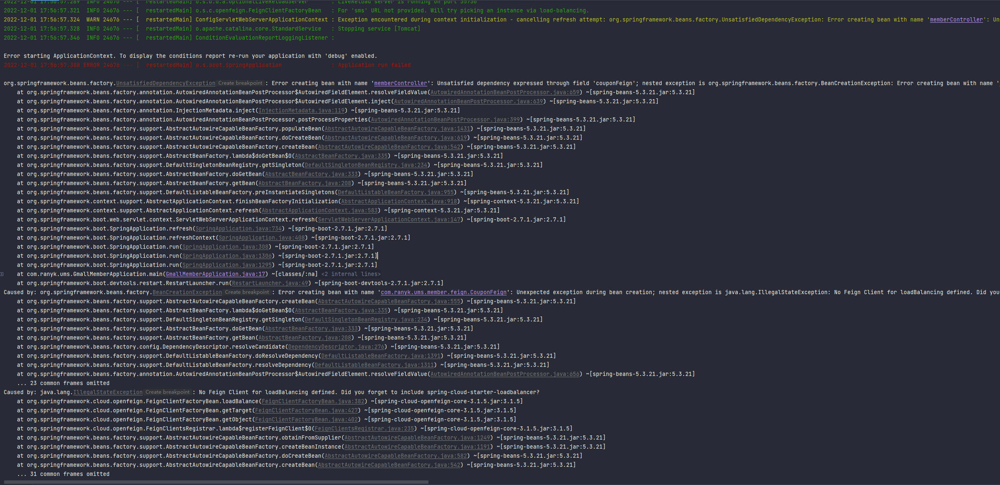

# `OpenFeign` 集成
> 本项目使用的 `OpenFeign` 版本为 `3.1.5`

## 一、功能模块接入 `OpenFeign`

> - 在需要调用远程接口的模块中引入 `spring-cloud-dependencies` 依赖管理,如在 `gmall-member` 中需要调用 `gmall-coupon`
    模块的接口则需要在 `gmall-member` 中引入依赖
>
>```xml
>
><dependencyManagement>
>    <dependencies>
>        <!-- https://mvnrepository.com/artifact/org.springframework.cloud/spring-cloud-dependencies -->
>        <dependency>
>            <groupId>org.springframework.cloud</groupId>
>            <artifactId>spring-cloud-dependencies</artifactId>
>            <version>2021.0.5</version>
>            <type>pom</type>
>            <scope>import</scope>
>        </dependency>
>    </dependencies>
></dependencyManagement>
>```
>
> - 在需要调用远程接口的模块中引入 `spring-cloud-starter-openfeign` 依赖,如在 `gmall-member` 中需要调用 `gmall-coupon`
    模块的接口则需要在 `gmall-member` 中引入依赖
>
>```xml
>
><dependencies>
>    <!-- https://mvnrepository.com/artifact/org.springframework.cloud/spring-cloud-starter-loadbalancer -->
>    <dependency>
>        <groupId>org.springframework.cloud</groupId>
>        <artifactId>spring-cloud-starter-loadbalancer</artifactId>
>        <version>3.1.5</version>
>    </dependency>
></dependencies>
>```
> - 在对应的模块启动类上添加 `@EnableFeignClients(basePackages = {"需要扫描的OpenFeign接口路径"})`
    ,比如在 `gmall-member` 模块中需要扫描的路径为 `com.ranyk.ums.member.feign`
>```java
>package com.ranyk.ums;
>
>import org.springframework.boot.SpringApplication;
>import org.springframework.boot.autoconfigure.SpringBootApplication;
>import org.springframework.cloud.client.discovery.EnableDiscoveryClient;
>import org.springframework.cloud.openfeign.EnableFeignClients;
>
>/**
> * @author ranyk
> */
>// 启用 Feign 远程调用
>@EnableFeignClients(basePackages = {"com.ranyk.ums.member.feign"})
>@SpringBootApplication
>// 启用 Nacos 服务注册,也可理解为 启用 Discovery 客户端,把本模块作为一个客户端 
>@EnableDiscoveryClient
>public class GmallMemberApplication {
>
>    public static void main(String[] args) {
>        SpringApplication.run(GmallMemberApplication.class, args);
>    }
>
>}
>```
> - 定义 `Feign` 接口,如本项目中 `gmall-member` 定义的 `Feign` 接口如下:
>```java
>package com.ranyk.ums.member.feign;
>
>import com.ranyk.common.utils.R;
>import org.springframework.cloud.openfeign.FeignClient;
>import org.springframework.stereotype.Component;
>import org.springframework.web.bind.annotation.RequestMapping;
>
>/**
> * CLASS_NAME: CouponFeign.java <br/>
> *
> * @author ranyk           <br/>
> * @version V1.0           <br/>
> * @description: CouponFeign 远程调用接口  <br/>
> * @date: 2022-12-01 <br/>
> */
>// 当前接口注册为 Bean 交由 Spring 管理
>@Component
>// 申明需要调用那个服务模块,该名称需要和对应的服务注册中心的服务名一致,可在 application.yml 中 spring.application.name 配置
>@FeignClient("sms")
>public interface CouponFeign {
>
>    // 定义调用服务的那个接口,该路径必须为全路径
>    @RequestMapping("coupon/coupon/getAllCoupon")
>    R getAllCoupon();
>}
>```
>
> - 在对应微服务中定义有关接口,如本项目中 `gmall-member` 需要调用 `gmall-coupon` 模块的 `getAllCoupon`
    接口,则在 `gmall-coupon` 模块中的接口定义如下:
>
>```java
>package com.ranyk.sms.coupon.controller;
>
>import java.util.ArrayList;
>import java.util.Arrays;
>import java.util.List;
>import java.util.Map;
>
>import org.springframework.beans.factory.annotation.Autowired;
>import org.springframework.web.bind.annotation.PathVariable;
>import org.springframework.web.bind.annotation.RequestBody;
>import org.springframework.web.bind.annotation.RequestMapping;
>import org.springframework.web.bind.annotation.RequestParam;
>import org.springframework.web.bind.annotation.RestController;
>
>import com.ranyk.sms.coupon.entity.CouponEntity;
>import com.ranyk.sms.coupon.service.CouponService;
>import com.ranyk.common.utils.PageUtils;
>import com.ranyk.common.utils.R;
>
>
>/**
> * 优惠券信息
> *
> * @author ranYk
> * @date 2022-07-29 17:37:28
> */
>@RestController
>@RequestMapping("coupon/coupon")
>public class CouponController {
>    @Autowired
>    private CouponService couponService;
>
>    /**
>     * 模拟获取所有优惠券
>     *
>     * @return 返回请求响应对象
>     */
>    @RequestMapping("getAllCoupon")
>    public R getAllCoupon() {
>        List<CouponEntity> coupons = new ArrayList<>(10);
>        for (int i = 1; i < 10; i++) {
>            CouponEntity coupon = new CouponEntity();
>            coupon.setCouponName("满" + i + "减 0." + i);
>            coupons.add(coupon);
>        }
>        return R.ok().put("coupons", coupons);
>    }
>}
>```

## 二、使用 `OpenFeign 3.1.5` 启动异常

### 1）、异常 `Unexpected exception during bean creation; nested exception is java.lang.IllegalStateException: No Feign Client for loadBalancing defined. Did you forget to include spring-cloud-starter-loadbalancer?`


> 1. 异常原因
>    1. `SpringCloud Feign` 在 `Hoxton.M2 RELEASED` 版本之后不再使用 `Ribbon` 而是使用 `spring-cloud-loadbalancer`
             ,所以在不引入 `spring-cloud-loadbalancer` 情况下会报错
>    2. [参考链接 feign 注入失败及 Unexpected exception during bean creation； nested exception is java.lang.IllegalStateE问题](https://blog.csdn.net/weixin_44592837/article/details/125005325)
> 2. 解决方案
>    1. 导入以下依赖即可
>
>```xml
><!-- https://mvnrepository.com/artifact/org.springframework.cloud/spring-cloud-starter-loadbalancer -->
><dependency>
>    <groupId>org.springframework.cloud</groupId>
>    <artifactId>spring-cloud-starter-loadbalancer</artifactId>
>    <version>3.1.5</version>
></dependency>
>```
